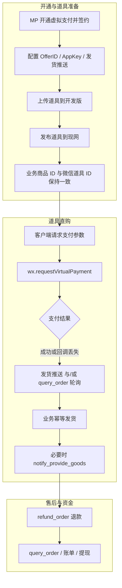
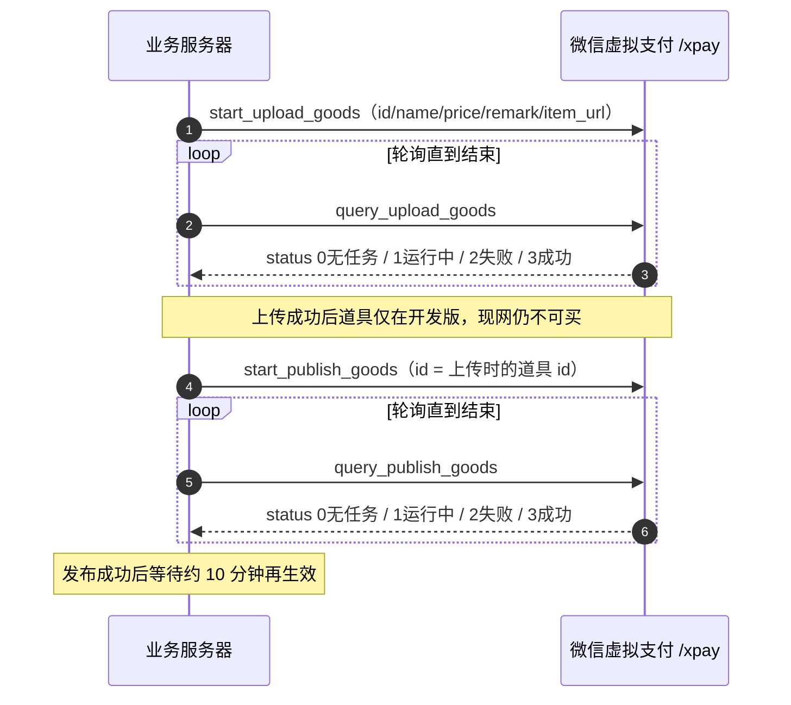
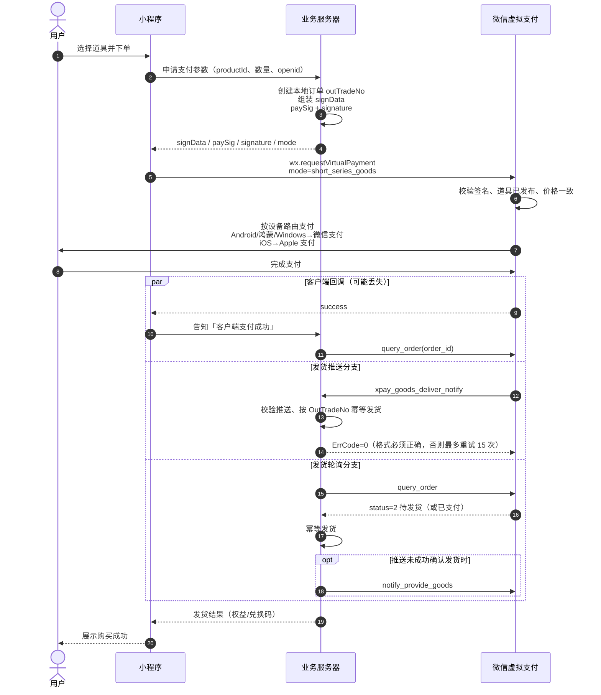
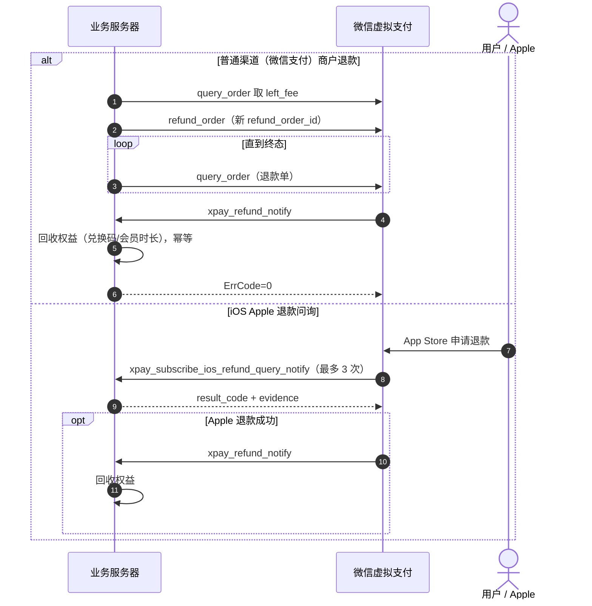

# 微信虚拟支付（道具直购）对接说明

本文梳理企业/个体户小程序虚拟支付中 **道具（goods）** 的对接流程，覆盖道具同步、直购下单、发货确认、退款与签名。代币（coin）仅作对照，不作为本项目主路径。

官方依据：

- [虚拟支付：企业、个体户（产品与时序）](https://developers.weixin.qq.com/miniprogram/dev/platform-capabilities/business-capabilities/virtual-payment.html)
- [虚拟支付服务端接口列表](https://developers.weixin.qq.com/miniprogram/dev/server/API/VirtualPayment/)
- [wx.requestVirtualPayment](https://developers.weixin.qq.com/miniprogram/dev/api/payment/wx.requestVirtualPayment.html)

---

## 1. 对接范围与角色

### 1.1 适用场景

小程序内售卖虚拟商品（会员档、课程解锁等），须走虚拟支付。本项目采用 **道具直购**（`mode = short_series_goods`），不走代币充值后再扣减。

道具与代币均为 Android / iOS 双端互通；iOS 端实际走 Apple 支付（微信客户端需 ≥ 8.0.68）。Apple 支付不支持沙箱，仅现网。

### 1.2 参与角色

| 角色 | 职责 |
| --- | --- |
| 用户 | 选购、完成支付、接收权益 |
| 小程序客户端 | 拉登录态、请求下单参数、调用 `wx.requestVirtualPayment`、展示结果 |
| 业务服务器 | 生成本地订单与签名、幂等发货、退款、对账 |
| 微信虚拟支付 | 校验签名与道具、路由支付渠道、推送发货/退款、提供订单查询 |

### 1.3 关键凭证（MP：虚拟支付 → 基础配置）

| 凭证 | 用途 |
| --- | --- |
| AppID / AppSecret | 换 `access_token`、登录换 `session_key` |
| OfferID | `signData.offerId` |
| 现网 AppKey / 沙箱 AppKey | 计算 `paySig`；`env=0` 用现网，`env=1` 用沙箱 |
| 发货推送 Token / AESKey | 校验 `xpay_goods_deliver_notify` 等事件 |

现网小程序包禁止 `env=1`（错误码 `-15011`）。

---

## 2. 总览



---

## 3. 道具生命周期（上传 → 发布）

道具必须先进入微信虚拟支付后台（开发版），再发布到现网，否则下单报 `-15010`（道具未发布）或 `-15014`（发布未生效，约 10 分钟）。一次请求只处理 **一个** 道具；并发任务会返回 `268490012`。

也可在 MP「道具管理」手工上传/发布，接口路径与后台等价。



### 3.1 接口对照

| 步骤 | 接口 | 路径 | 要点 |
| --- | --- | --- | --- |
| 启动上传 | [start_upload_goods](https://developers.weixin.qq.com/miniprogram/dev/server/API/VirtualPayment/api_start_upload_goods) | `/xpay/start_upload_goods` | `id` 长度 (0,20]，仅字母数字 `_` `-`；`price` 单位分且 >0；图片 jpg/png |
| 查询上传 | [query_upload_goods](https://developers.weixin.qq.com/miniprogram/dev/server/API/VirtualPayment/api_query_upload_goods) | `/xpay/query_upload_goods` | 单项 `upload_status`：0 上传中 / 1 id 已存在 / 2 成功 / 3 失败 |
| 启动发布 | [start_publish_goods](https://developers.weixin.qq.com/miniprogram/dev/server/API/VirtualPayment/api_start_publish_goods) | `/xpay/start_publish_goods` | `publish_item[].id` 必须与上传 id 相同 |
| 查询发布 | [query_publish_goods](https://developers.weixin.qq.com/miniprogram/dev/server/API/VirtualPayment/api_query_publish_goods) | `/xpay/query_publish_goods` | 单项 `publish_status`：0 上传中 / 1 id 已存在 / 2 成功 / 3 失败 |

上述接口均需 `access_token` + `pay_sig`。

### 3.2 与本项目商品的约束

业务侧 `virtual_goods.goodsId` **必须等于** 微信道具 `id` / 下单 `productId`，且价格与微信侧道具单价一致（`goodsPrice` 单位分，校验失败为 `-15013`）。

---

## 4. 道具直购主流程

官方时序要求：**发货推送分支** 与 **发货轮询分支至少实现一个**；两者一起用更可靠。

`wx.requestVirtualPayment` 的 **success 可能丢失**（例如微信异常退出），不能把客户端回调当作唯一发货依据。

### 4.1 时序图



### 4.2 步骤说明

| 序号 | 动作 | 谁做 | 说明 |
| --- | --- | --- | --- |
| 1 | 选购 | 用户 / 小程序 | 展示价必须与即将传入的 `goodsPrice` 一致，避免投诉 |
| 2 | 申请支付参数 | 小程序 → 业务 | 带上已登录 `openid`、`productId`、购买数量 |
| 3 | 本地下单 + 签名 | 业务 | 生成一次性 `outTradeNo`（8–32 位，数字字母及 `_ - \| * @`，不能以 `_` 开头）；`goodsPrice` 以服务端权威价格为准 |
| 4 | 拉起支付 | 小程序 | `mode` 固定 `short_series_goods`；`signData` 必须是 **JSON 字符串** |
| 5 | 渠道路由 | 微信 | 见下表；iOS 另有用户侧条件（iOS 15+、微信 8.0.68+、最低 1 元、大陆 App Store 账号） |
| 6 | 支付成功感知 | 三路并行 | success 回调、消息推送、`query_order`；任一确认已支付即可进入发货，须幂等 |
| 7 | 发货 | 业务 | 本项目：绑定兑换码、计算会员时长等；同一 `OutTradeNo` 只发一次 |
| 8 | 通知微信已发货 | 业务 | 推送已用 `ErrCode=0` 应答则 **不必** 再调 `notify_provide_goods`；推送失败或只走轮询时再调 |

设备路由：

| 设备 | 支付系统 |
| --- | --- |
| Android、鸿蒙、Windows | 微信支付 |
| iOS | Apple 支付 |

客户端基础库需 ≥ 2.19.2，或 `wx.canIUse('requestVirtualPayment')`。

### 4.3 `signData`（道具直购）

`wx.requestVirtualPayment` 的 `signData` 以字符串传递，字段如下：

| 字段 | 必填 | 说明 |
| --- | --- | --- |
| offerId | 是 | MP 基础配置中的 OfferID |
| buyQuantity | 是 | 购买数量 |
| env | 否 | 0 现网 / 1 沙箱，默认 0 |
| currencyType | 是 | 仅 `CNY` |
| productId | 是（道具模式） | 微信道具 ID |
| goodsPrice | 是（道具模式） | 单价，单位 **分**，须与后台道具价格一致 |
| activitySellingPrice | 否 | 优惠实付价（分），须与 `goodsPrice` 一起传 |
| outTradeNo | 是 | 业务订单号，原则上一次性 |
| attach | 是 | 透传，会出现在发货推送 `GoodsInfo.Attach` |

### 4.4 发货推送 `xpay_goods_deliver_notify`

触发：用户 **现金购买道具且支付成功**。

关键字段：`OpenId`、`OutTradeNo`、`Env`、`GoodsInfo.ProductId/Quantity/OrigPrice/ActualPrice/Attach`，以及可能存在的 `WeChatPayInfo`（非微信支付渠道可能没有）。

推荐应答：

```xml
<xml><ErrCode>0</ErrCode><ErrMsg><![CDATA[success]]></ErrMsg></xml>
```

JSON 推送则回 `{"ErrCode":0,"ErrMsg":"success"}`。空 body 或纯文本 `success` 也视为成功。格式不对会重试，最多 15 次。

推送成功应答后，无需再调 `notify_provide_goods`。该接口仅用于推送异常时，把现金单改为已发货：

- [notify_provide_goods](https://developers.weixin.qq.com/miniprogram/dev/server/API/VirtualPayment/api_notify_provide_goods) → `/xpay/notify_provide_goods`
- `order_id` 与 `wx_order_id` 二选一，`env` 必填

### 4.5 订单查询 `query_order`

[query_order](https://developers.weixin.qq.com/miniprogram/dev/server/API/VirtualPayment/api_query_order) → `/xpay/query_order`  
查的是 **现金单**（非代币单）。`order_id` 与 `wx_order_id` 二选一。

`order.status`：

| 值 | 含义 | 业务建议 |
| --- | --- | --- |
| 0 | 初始化（未创建成功，不可支付） | 换新单号 |
| 1 | 创建成功 | 等待用户支付 |
| 2 | 已支付，待发货 | 执行发货，必要时 `notify_provide_goods` |
| 3 | 发货中 | 继续确保发货完成 |
| 4 | 已发货 | 本地应对齐已交付 |
| 5 | 已经退款 | 回收权益 |
| 6 | 已关闭 | 不可再用 |
| 7 | 退款失败 | 查因后重试或人工处理 |
| 8 | 用户退款完成 | 同退款成功处理 |
| 9 | 回收广告金完成 | 资金侧 |
| 10 | 分账回退完成 | 资金侧 |

`order_type`：0 普通虚拟支付 / 1 普通退款 / 7 苹果 iOS 支付 / 8 苹果 iOS 退款。

支付完成后客户端应轮询业务单状态，而不是只信 success。

---

## 5. 退款流程

Android 等走微信支付的订单，商户可对 **支付时间 365 天内** 的单发起退款。180 天内退款平台退还手续费，超过 180 天不退手续费。

`refund_order` **只表示启动任务成功**，最终要以 `query_order` 退款单状态，以及 `xpay_refund_notify` 为准。

Apple 支付 **不支持商户主动退款**。用户在 App Store 申请后，平台会推送 `xpay_subscribe_ios_refund_query_notify`（重复三次问询）。须在约 3 秒内应答：`result_code` 0 建议退款 / 1 拒绝退款，且 `evidence` 必填。连续 3 次未应答，微信向 Apple 返回「不确定」。若 Apple 实际退款成功，仍走 `xpay_refund_notify`。



[refund_order](https://developers.weixin.qq.com/miniprogram/dev/server/API/VirtualPayment/api_refund_order) 必填要点：

| 字段 | 说明 |
| --- | --- |
| openid | 下单用户 |
| order_id / wx_order_id | 二选一 |
| refund_order_id | 本次退款单号，长度 [8,32] |
| left_fee | 当前剩余可退金额（分），须与 `query_order` 一致，否则 `268490016` |
| refund_fee | (0, left_fee] |
| refund_reason | `0`–`5` 固定枚举 |
| req_from | `1` 客服 / `2` 用户发起 / `3` 其它 |
| env | 0 / 1 |

禁止对核销状态订单退款（`268490013`）；退款进行中可用相同参数重试（`268490014`）。

---

## 6. 签名

客户端 `wx.requestVirtualPayment` 与服务端 `/xpay/*` 都使用两套 HMAC-SHA256（输出 hex）：

| 签名 | 算法 | 客户端 | 服务端 |
| --- | --- | --- | --- |
| 支付签名 `paySig` / `pay_sig` | `hmac_sha256(appKey, uri + '&' + signData或post_body)` | `uri` 固定为 `requestVirtualPayment` | `uri` 为路径，如 `/xpay/query_order`，不含 query |
| 用户态签名 `signature` | `hmac_sha256(session_key, signData或post_body)` | 对 `signData` 字符串 | 对 POST body；`session_key` 过期返回 `268490009` / `-15007` |

注意：

1. 参与签名的 body 必须与真实 HTTP body **字节级一致**。
2. AppKey 必须与 `env` 匹配。
3. 服务端 URL 形如：`https://api.weixin.qq.com/xpay/query_order?access_token=...&pay_sig=...`

---

## 7. 消息推送一览（道具相关）

| Event | 时机 | 处理 |
| --- | --- | --- |
| `xpay_goods_deliver_notify` | 现金买道具支付成功 | 幂等发货，正确应答 |
| `xpay_refund_notify` | 退款完成 | 回收权益 |
| `xpay_complaint_notify` | 用户投诉 | 走投诉接口处理 |
| `xpay_wxpay_callback_notify` | 尽职调查 / 管控 | 运营跟进 |
| `xpay_subscribe_ios_refund_query_notify` | Apple 退款问询 | 限时返回建议 |
| `xpay_coin_pay_notify` | 代币扣减成功 | 本项目不使用 |

投诉处理另有：`get_complaint_list` / `get_complaint_detail` / `get_negotiation_history` / `response_complaint` / `complete_complaint` / `upload_vp_file` 等，见[接口列表](https://developers.weixin.qq.com/miniprogram/dev/server/API/VirtualPayment/)。

---

## 8. 资金、账单与结算（对接后运营）

与道具订单配套、非下单主路径：

| 能力 | 接口 |
| --- | --- |
| 可提现余额 | `/xpay/query_biz_balance` |
| 创建 / 查询提现 | `/xpay/create_withdraw_order`、`/xpay/query_withdraw_order` |
| 日账单（普通虚拟支付） | `/xpay/download_bill`（首次触发生成 URL，再轮询） |
| iOS 月结账单 | `/xpay/download_ios_settlement_bill` |
| 下载订单明细 | `/xpay/start_download_order` → `/xpay/query_download_order` |

结算：T+3 分账。待结算金额尚未扣技术服务费。iOS 订单由 Apple 结算（通常自然月结束后 45–60 天，扣佣金后划转腾讯，再到开发者虚拟支付账户）。

---

## 9. 常见错误（下单与道具）

| 码 | 含义 | 处理 |
| --- | --- | --- |
| -15002 | `outTradeNo` 重复 | 换新单号 |
| -15005 / -15006 | signature / paySig 错误 | 核对 session_key、AppKey、body 一致性 |
| -15007 | session_key 过期 | 重新登录 |
| -15008 | 二级商户进件未完成 | 完成开通签约 |
| -15010 | 道具未发布 | 先 `start_publish_goods` 且查询成功 |
| -15013 | `goodsPrice` 与后台不一致 | 以微信道具单价为准 |
| -15014 | 发布未生效 | 等待约 10 分钟 |
| -15011 | 现网包使用了沙箱 env | 现网必须 `env=0` |
| -2 | 用户取消 | 关单，下次换新 `outTradeNo` |

---

## 10. 推荐落地清单

1. MP 开通虚拟支付，配好 OfferID、双环境 AppKey、发货推送。
2. 商品创建时同步上传并发布道具；`goodsId === productId`，价格单位统一为分。
3. 服务端下单：落本地单 → 算签名 → 返回客户端；价格只信服务端。
4. 同时实现 **发货推送** 与 **query_order 轮询**，发货逻辑幂等。
5. 推送已成功则不调 `notify_provide_goods`；仅补偿路径调用。
6. 退款先查 `left_fee`；iOS 单独实现问询应答。
7. 沙箱只用于 Android 等微信支付通路；iOS 只能现网验证。

### 落地实现（本仓库）

| 清单 | 实现 |
| --- | --- |
| 1 | `.env`：`WECHAT_XPAY_*`；`GET /api/xpay/credential-status` 检查是否配齐（不回传密钥）。消息推送 URL：`/api/xpay/callback` |
| 2 | 新增/编辑会员或课程时调用 `start_upload_goods` → `start_publish_goods`；`goodsId` 即道具 ID，单价按分同步 |
| 3 | `POST /api/wechat-mini/xpay/create-order`：落 `orders` 后返回 `mode/signData/paySig/signature` |
| 4 | `POST /api/xpay/callback` 处理 `xpay_goods_deliver_notify`；`POST /api/wechat-mini/xpay/confirm` + 每 30s 轮询 `query_order`；发货绑定兑换码且幂等 |
| 5 | 推送成功置 `deliverNotifyAcked`；仅轮询发货且微信仍为待发货时调用 `notify_provide_goods` |
| 6 | 后台 `POST /api/xpay/orders/:id/refund` 先查 `left_fee`；Apple 渠道拒绝商户退款；回调处理 `xpay_refund_notify` 与 iOS 问询 |
| 7 | `WECHAT_XPAY_ENV=1` 且 `platform=ios` 时拒绝下单 |

小程序支付成功后请调用 `confirm`，并以 `GET /api/wechat-mini/xpay/orders/:orderNo` 轮询本地发货状态，勿只依赖 `wx.requestVirtualPayment` 的 success。
